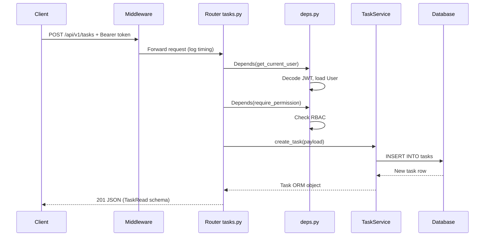

# 03 — Project Structure

Understand every folder and how a request flows through the codebase.

---

## What you'll learn

- Industry-standard FastAPI folder layout
- Separation of concerns (router → service → model)
- App factory pattern
- Where to add new features

---

## THEORY

### Why layered architecture?

Without layers, all code ends up in one file — hard to test and maintain. Production apps split responsibilities:

```
HTTP layer      →  handles URLs, status codes, auth checks
Service layer   →  business rules (who can see what)
Data layer      →  database reads/writes
Schema layer    →  validates JSON in/out
```

### Full folder map

```
task-api/
├── app/
│   ├── main.py              # uvicorn entry: app = create_app()
│   ├── factory.py           # create_app() — wires everything together
│   │
│   ├── api/                 # HTTP LAYER
│   │   ├── deps.py          # Shared dependencies (auth, DB, services)
│   │   └── v1/              # API version 1
│   │       ├── router.py    # Combines all v1 routers
│   │       └── endpoints/
│   │           ├── auth.py
│   │           ├── tasks.py
│   │           ├── users.py
│   │           └── health.py
│   │
│   ├── core/                # CONFIG & CROSS-CUTTING
│   │   ├── config.py        # Settings from .env
│   │   ├── security.py      # JWT + password hashing
│   │   ├── rbac.py          # Roles & permissions
│   │   ├── limiter.py       # Rate limiting
│   │   ├── logging.py
│   │   └── exceptions.py    # Error handlers
│   │
│   ├── db/                  # DATABASE LAYER
│   │   ├── base.py          # SQLAlchemy Base class
│   │   ├── session.py       # Engine, get_db()
│   │   └── init_db.py       # Create tables + seed data
│   │
│   ├── models/              # ORM MODELS (database tables)
│   │   ├── user.py
│   │   └── task.py
│   │
│   ├── schemas/             # PYDANTIC (API validation)
│   │   ├── auth.py
│   │   ├── task.py
│   │   └── user.py
│   │
│   ├── services/            # BUSINESS LOGIC
│   │   ├── auth_service.py
│   │   └── task_service.py
│   │
│   └── middleware/          # HTTP MIDDLEWARE
│       └── request_logging.py
│
├── alembic/                 # Database migrations
├── tests/                   # pytest tests
├── .env.example             # Environment template
└── requirements.txt
```

---

## Request flow (detailed)



---

## App factory pattern

**File:** `app/factory.py`

Instead of creating `app` directly in `main.py`, we use a function:

```python
def create_app() -> FastAPI:
    app = FastAPI(...)
    app.add_middleware(...)
    app.include_router(api_router, prefix="/api/v1")
    return app
```

**Why?** Tests can create fresh app instances; production can pass different config.

---

## Where to add new features

| I want to add… | Put it in… |
|----------------|------------|
| New endpoint | `app/api/v1/endpoints/` + register in `router.py` |
| New database table | `app/models/` + Alembic migration |
| New request/response shape | `app/schemas/` |
| Business rule | `app/services/` |
| New env variable | `app/core/config.py` + `.env.example` |
| Auth rule | `app/core/rbac.py` or `app/api/deps.py` |

---

## PRACTICE

1. Open `app/factory.py` — list every middleware and router registered.
2. Open `app/api/v1/router.py` — see how routers are combined.
3. Pick `POST /api/v1/tasks` — trace from `tasks.py` → `task_service.py` → `models/task.py`.

---

## Common mistakes

| Mistake | Better approach |
|---------|-----------------|
| SQL queries in router | Move to service layer |
| Validation logic in router | Use Pydantic schemas |
| Hardcoded secrets | Use `config.py` + `.env` |

---

## Next

→ [04 — Database & SQLAlchemy](04-database-and-sqlalchemy.md)
