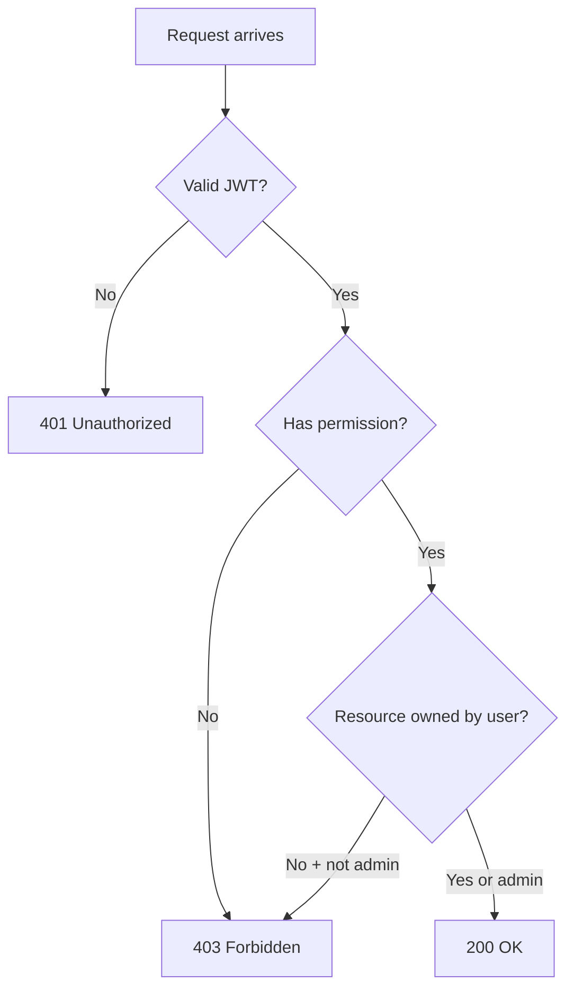

# 06 — RBAC (Role-Based Access Control)

Control who can do what — roles, permissions, and owner-scoped data.

---

## What you'll learn

- Difference between authentication and authorization
- Roles vs permissions
- How task ownership works
- Admin vs regular user access

---

## THEORY

### Authentication vs authorization

| | Authentication | Authorization |
|--|----------------|---------------|
| Question | **Who are you?** | **What can you do?** |
| Mechanism | JWT login | RBAC checks |
| Failure | 401 Unauthorized | 403 Forbidden |

### Roles in task-api

| Role | Description |
|------|-------------|
| **user** | Normal account — manages own tasks only |
| **admin** | Full access — all tasks + user management |

**File:** `app/models/user.py` → `UserRole` enum

### Permissions

Fine-grained actions mapped to roles:

**File:** `app/core/rbac.py`

```python
class Permission(str, Enum):
    TASK_READ = "task:read"
    TASK_WRITE = "task:write"
    TASK_DELETE = "task:delete"
    USER_READ = "user:read"
    USER_MANAGE = "user:manage"

ROLE_PERMISSIONS = {
    UserRole.USER: {TASK_READ, TASK_WRITE, TASK_DELETE},
    UserRole.ADMIN: {all permissions},
}
```

### Enforcing permissions

**In routers** (`app/api/v1/endpoints/tasks.py`):

```python
@router.get("")
def list_tasks(_user: User = Depends(require_permission(Permission.TASK_READ)), ...):
```

**In services** (`app/services/task_service.py`):

```python
def _ensure_access(self, task: Task):
    if not is_admin(self.current_user) and task.owner_id != self.current_user.id:
        raise ForbiddenError("You do not have access to this task")
```

**Two layers:** permission check at router + ownership check in service.

### Owner-scoped tasks

Every task has `owner_id` (foreign key to user):

- **user** listing tasks → SQL filters `WHERE owner_id = current_user.id`
- **admin** listing tasks → sees all rows

### Admin-only endpoints

**File:** `app/api/v1/endpoints/users.py`

```python
def list_users(_admin: RequireAdmin, ...):
```

`RequireAdmin` = dependency that requires `UserRole.ADMIN`.

---

## PRACTICE

### 1. User creates a task

Login as `user@example.com`, create a task, note the `id`.

### 2. Another user cannot access it

Login as `admin@example.com` or register a second user — try `GET /tasks/{id}` with the other user's token → **403**.

### 3. Admin sees all tasks

Login as `admin@example.com` → `GET /api/v1/tasks` → sees tasks from all users.

### 4. User cannot list users

As regular user → `GET /api/v1/users` → **403**.

### 5. Admin lists users

As admin → `GET /api/v1/users` → **200** with user list.

---

## RBAC decision flow



---

## Common mistakes

| Mistake | Fix |
|---------|-----|
| Only checking auth, not ownership | Always verify resource belongs to user |
| Hardcoding admin email checks | Use role enum + RBAC |
| Putting RBAC only in router | Also enforce in service layer |

---

## Next

→ [07 — Rate Limiting & Middleware](07-rate-limiting-and-middleware.md)
