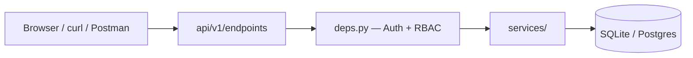

# FastAPI with Python — Learning Guide

Complete step-by-step guide for learning backend development with FastAPI using the **task-api** project in this repo.

---

## Before you start

### Prerequisites (from core-python)

Complete these **core-python** modules first:

| Module | Why you need it |
|--------|-----------------|
| [01-fundamentals](../core-python/modules/01-fundamentals/) | Python syntax, venv, running scripts |
| [03-functions-and-modules](../core-python/modules/03-functions-and-modules/) | Functions, imports, packages |
| [04-object-oriented-programming](../core-python/modules/04-object-oriented-programming/) | Classes — FastAPI uses OOP heavily |
| [05-data-handling](../core-python/modules/05-data-handling/) | JSON, files, exceptions, logging |
| [07-advanced-and-production](../core-python/modules/07-advanced-and-production/) | Testing (pytest), venv recap |

You do **not** need to finish modules 06 or all of 07 — but testing basics help.

### What you will build

A **Task Management REST API** — users log in, create tasks, and admins manage everything. Same pattern used in real companies (auth → permissions → database → API).

---

## Learning path (follow in order)

| Step | Guide | Time | What you learn |
|------|-------|------|----------------|
| 1 | [Getting Started](docs/01-getting-started.md) | 30 min | Setup, run server, Swagger UI, first API call |
| 2 | [How REST APIs Work](docs/02-how-rest-apis-work.md) | 45 min | HTTP, JSON, status codes, CRUD |
| 3 | [Project Structure](docs/03-project-structure.md) | 1 hr | Folders, layers, request flow |
| 4 | [Database & SQLAlchemy](docs/04-database-and-sqlalchemy.md) | 1.5 hr | ORM, sessions, migrations, seed data |
| 5 | [Auth & JWT](docs/05-auth-and-jwt.md) | 1.5 hr | Login, tokens, password hashing |
| 6 | [RBAC](docs/06-rbac.md) | 1 hr | Roles, permissions, owner access |
| 7 | [Rate Limiting & Middleware](docs/07-rate-limiting-and-middleware.md) | 45 min | slowapi, logging, CORS |
| 8 | [Errors & Logging](docs/08-error-handling-and-logging.md) | 45 min | Exception handlers, HTTP errors |
| 9 | [Testing](docs/09-testing.md) | 1 hr | pytest, fixtures, auth in tests |
| 10 | [Docker & Deployment](docs/10-docker-and-deployment.md) | 1 hr | Postgres, Docker Compose, production |
| 11 | [API Reference](docs/11-api-reference.md) | reference | All endpoints with examples |
| 12 | [Interview Concepts](docs/12-interview-concepts.md) | reference | Common backend interview Q&A |

**Total:** ~10–12 hours of focused learning.

---

## Quick setup (Step 1 summary)

```bash
cd fastapi-with-python/task-api
python3 -m venv .venv
source .venv/bin/activate          # Windows: .venv\Scripts\activate
pip install -r requirements.txt
cp .env.example .env
make dev
```

Open:

- **Swagger UI:** http://127.0.0.1:8000/docs
- **Health check:** http://127.0.0.1:8000/api/v1/health

### Dev accounts (auto-created)

| Email | Password | Role |
|-------|----------|------|
| admin@example.com | admin123 | admin |
| user@example.com | user123 | user |

---

## How to use this guide

1. **Read** the guide section (theory in plain English).
2. **Open** the linked source files in `task-api/app/` — read the code.
3. **Run** the “Try it yourself” commands.
4. **Change** something small (e.g. add a field) and see what breaks.
5. **Run tests:** `make test` after each major step.

Every guide follows: **THEORY → CODE LOCATION → PRACTICE → COMMON MISTAKES**.

---

## Architecture at a glance



**Request flow example:** `POST /api/v1/tasks`

1. Client sends JSON + `Authorization: Bearer <token>`
2. **Router** (`tasks.py`) receives request
3. **deps.py** validates JWT → loads current user → checks permission
4. **TaskService** creates row in database
5. **Pydantic schema** converts DB row → JSON response

---

## Project location

```
fastapi-with-python/
├── LEARNING-GUIDE.md          ← you are here
├── README.md
├── docs/                      ← step-by-step guides (01–12)
└── task-api/                  ← the actual project
    ├── app/
    ├── tests/
    ├── alembic/
    └── README.md              ← quick reference
```

---

## Stuck? Debug checklist

1. Is the server running? (`make dev`)
2. Did you activate `.venv`?
3. For protected routes — did you login and pass the Bearer token?
4. Check terminal logs (request logging middleware prints every call)
5. Run `make test` — failing tests show what broke
6. Read the error `detail` in JSON response

---

## Next step

Start here: **[docs/01-getting-started.md](docs/01-getting-started.md)**
