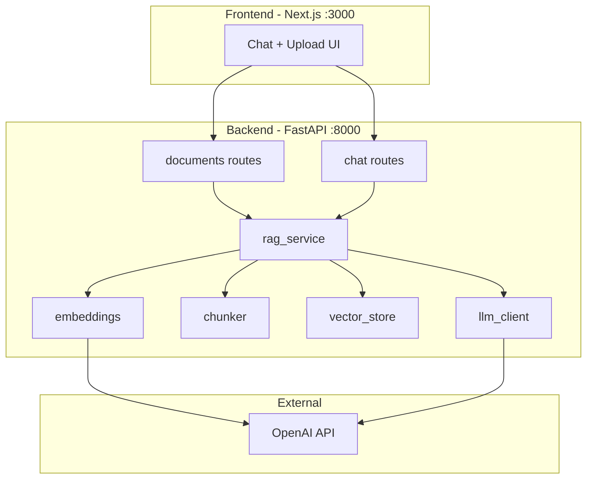

# Architecture — RAG Assistant

Next.js frontend + FastAPI backend + vector store.

---

## System diagram



---

## Ingest flow (upload)

```
File upload → extract text → chunk → embed each chunk → store in JSON vector file + metadata
```

## Query flow (chat)

```
Question → embed question → similarity search → top-k chunks → LLM prompt → answer + sources
```

---

## Folder structure

```
rag-assistant/
├── backend/
│   └── app/
│       ├── main.py
│       ├── core/config.py
│       ├── api/routes/
│       │   ├── health.py
│       │   ├── documents.py
│       │   └── chat.py
│       └── services/
│           ├── chunker.py
│           ├── embeddings.py
│           ├── vector_store.py
│           ├── llm_client.py
│           └── rag_service.py
└── frontend/
    ├── app/page.tsx
    └── lib/api.ts
```

---

## Security

- API keys only in `backend/.env`
- Frontend calls backend via `NEXT_PUBLIC_API_URL`
- Uploaded files stored in `backend/data/uploads/` (gitignored)

---

## Next

→ [Setup and run](03-setup-and-run.md)
